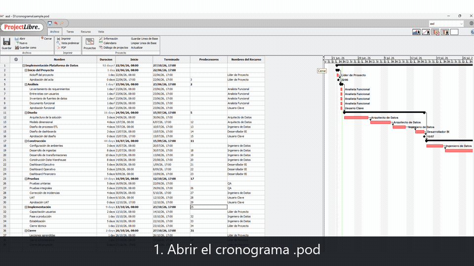
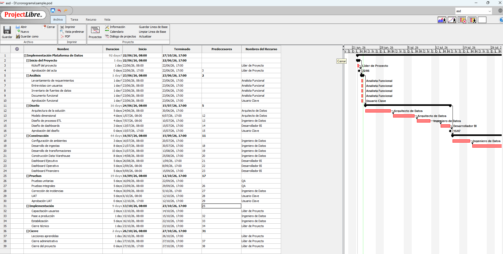
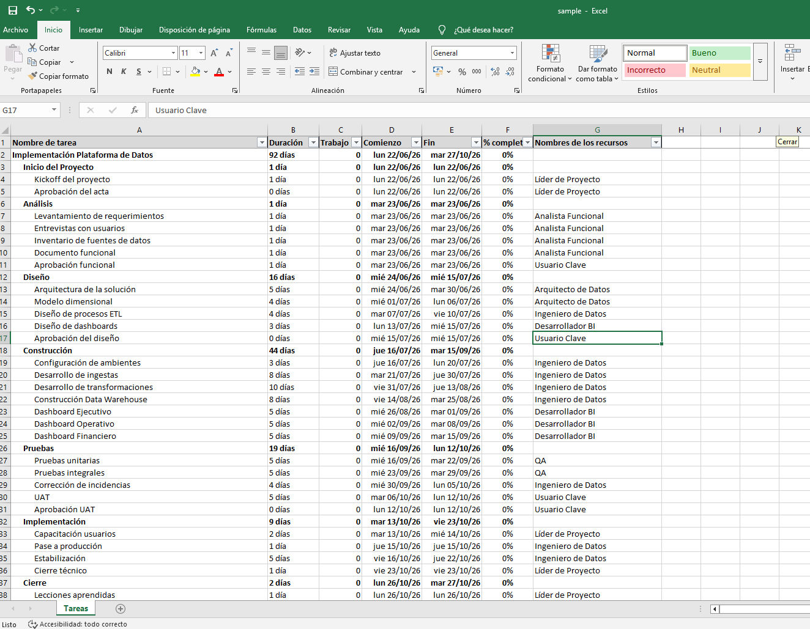

# MPP to Excel Exporter


## ¿Qué hace?

Convierte cronogramas de Microsoft Project y ProjectLibre en reportes Excel listos para compartir, sin requerir las aplicaciones originales.

## Características

- ✔️ Compatible con Microsoft Project (`.mpp`).
- ✔️ Compatible con ProjectLibre (`.pod`).
- ✔️ Exportación a Excel (`.xlsx`).
- ✔️ Conserva jerarquías e indentación.
- ✔️ Exporta recursos, duración, fechas y avance.
- ✔️ Destaca tareas resumen e hitos.
- ✔️ Genera filtros y formatos de fecha y porcentaje.
- ✔️ No requiere Microsoft Project ni ProjectLibre instalados.

## Demostración



## Flujo de procesamiento

```text
Archivo .mpp/.pod → MPXJ → JSON temporal → pandas/openpyxl → Reporte .xlsx
```

La lectura de los formatos MPP y POD se delega a [MPXJ](https://www.mpxj.org/), una biblioteca de código abierto para archivos de planificación. Python se encarga de transformar los datos y construir el reporte final.

## Tecnologías

- Python 3.10+
- pandas
- openpyxl
- Java 17 LTS (JDK recomendado)
- MPXJ 15.x

## Instalación

1. Clona este repositorio, crea el entorno virtual e instala las dependencias:

```powershell
py -m venv .venv
.\.venv\Scripts\python.exe -m pip install -r requirements.txt
```

No es necesario activar el entorno virtual: los comandos de este README invocan directamente su intérprete de Python. Esto evita errores en equipos donde PowerShell bloquea la ejecución de `Activate.ps1`.

Si prefieres activarlo, puedes habilitar scripts únicamente durante la sesión actual:

```powershell
Set-ExecutionPolicy -Scope Process -ExecutionPolicy Bypass
.\.venv\Scripts\Activate.ps1
```

Este cambio no modifica permanentemente la política de ejecución del sistema.

2. Instala **Java 17 LTS en su edición JDK**. Se recomienda Eclipse Temurin 17; durante la instalación, habilita las opciones para agregar Java al `PATH` y definir `JAVA_HOME`.

Después, cierra y vuelve a abrir PowerShell y verifica la instalación:

```powershell
java -version
```

La salida debe comenzar con una versión `17`. Por ejemplo:

```text
openjdk version "17.x.x"
```

> Instala el **JDK**, no solamente el JRE. Aunque MPXJ puede funcionar con otras versiones compatibles, Java 17 LTS es la versión recomendada y documentada para este proyecto.

3. Descarga la [distribución binaria oficial de MPXJ 15.3.1](https://github.com/joniles/mpxj/releases/download/v15.3.1/mpxj-15.3.1.zip).

> No descargues `Source code (zip)` ni `mpxj-master.zip`: contienen las fuentes y no incluyen la distribución ejecutable que necesita este proyecto.

Descomprime el archivo y copia su contenido en la carpeta `mpxj/` del proyecto. La estructura debe quedar así:

```text
mpp-to-excel-exporter/
├── mpp_to_excel.py
└── mpxj/
    ├── mpxj.jar
    ├── lib/
    └── script/
```

Comprueba la instalación desde PowerShell:

```powershell
Test-Path .\mpxj\mpxj.jar
Test-Path .\mpxj\lib
```

Ambos comandos deben devolver `True`. Si conservas MPXJ en otra ubicación, usa `--mpxj-home` o define la variable `MPXJ_HOME`.

> MPXJ no se incluye en este repositorio para evitar versionar aproximadamente 69 MB de binarios y código de terceros.

## Uso

```powershell
.\.venv\Scripts\python.exe mpp_to_excel.py "ruta\cronograma.mpp"
```

También admite archivos de ProjectLibre:

```powershell
.\.venv\Scripts\python.exe mpp_to_excel.py "ruta\cronograma.pod"
```

El Excel se crea junto al archivo de entrada. También puedes indicar otra salida o instalación de MPXJ:

```powershell
.\.venv\Scripts\python.exe mpp_to_excel.py "entrada.mpp" -o "reportes\cronograma.xlsx" --mpxj-home "C:\tools\mpxj"
```

## Formatos compatibles

| Extensión | Aplicación de origen |
|---|---|
| `.mpp` | Microsoft Project |
| `.pod` | ProjectLibre |

## Ejemplo incluido

El repositorio incluye [`example/example.pod`](example/example.pod), un cronograma ficticio de ProjectLibre para probar el convertidor sin utilizar información corporativa.

### Entrada: cronograma en ProjectLibre



### Salida: reporte generado en Excel



Para reproducir el ejemplo:

```powershell
.\.venv\Scripts\python.exe mpp_to_excel.py ".\example\example.pod"
```

El comando genera `example/example.xlsx`. Este archivo de salida no se versiona porque puede regenerarse en cualquier momento.
## Columnas exportadas

| Columna | Descripción |
|---|---|
| Nombre de tarea | Nombre e indentación según el nivel jerárquico |
| Duración | Minutos, horas o jornadas laborales de 8 horas |
| Trabajo | Esfuerzo expresado en horas |
| Comienzo / Fin | Fechas planificadas |
| % completado | Avance de la tarea |
| Nombres de los recursos | Recursos asignados, sin duplicados |

## Pruebas

Las pruebas unitarias validan las transformaciones sin necesitar Java ni archivos corporativos:

```powershell
.\.venv\Scripts\python.exe -m pip install -r requirements-dev.txt
.\.venv\Scripts\python.exe -m pytest -q
```

## Privacidad

Los cronogramas pueden contener nombres de personas, iniciativas y fechas internas. Por eso `.gitignore` excluye archivos MPP, POD, Excel, comprimidos, temporales y la instalación local de MPXJ. Los datos usados en pruebas son completamente ficticios.

## Limitaciones

- La duración se presenta usando jornadas estándar de 8 horas.
- La conversión requiere Java y una distribución local de MPXJ.
- El reporte cubre los campos más útiles para seguimiento; no busca replicar todas las vistas de Microsoft Project.

## Estado del proyecto

Versión actual: v1.0.0  
Estado: Mantenimiento activo.

## Próximas mejoras

- Procesamiento por lotes de una carpeta.
- Configuración de horas por jornada.
- Hoja resumen con indicadores del cronograma.
- Empaquetado como aplicación de escritorio.

## Licencia

Este proyecto se distribuye bajo la licencia MIT. Consulte el archivo [LICENSE](LICENSE) para más detalles.
